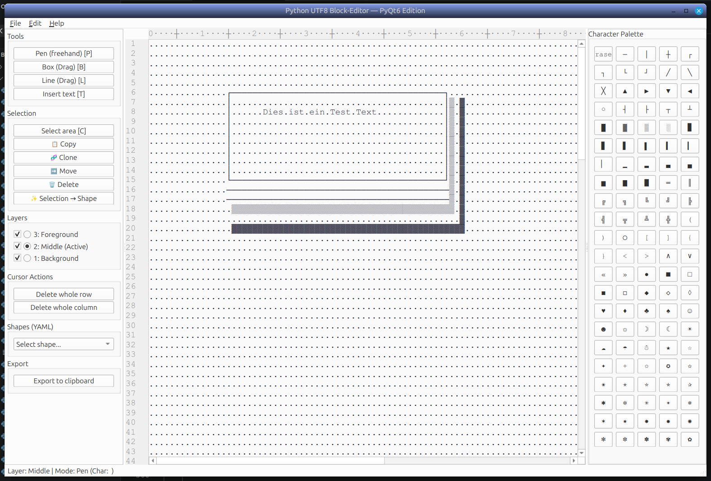

# Block Designer 

A small block-based drawing editor written in Python. 
The editor is a lightweight tool for composing and manipulating rectangular "blocks" on a canvas.

## Idea

The original idea for the editor came to me because I needed to create a few diagrams and flowcharts in Markdown. The diagrams created with the editor can also be useful for posting visualizations of your own ideas using an AI chatbot. And, of course, you can also create artistic-style block diagrams.

## Features (examples)

- Create and move rectangular blocks
- Save and load drawings (YAML)
- Multiple UI variants (Qt6-based front-end included)

## Screenshot



## Requirements

- Python 3.8 or newer
- See `requirements.txt` for Python package dependencies

Typically the project depends on:

- `pyyaml` — for reading/writing shapes and drawings
- `PyQt6` — GUI (used by the Qt6)

## Installation

1. Create and activate a virtual environment (recommended):

```bash
python -m venv venv
source venv/bin/activate
```

2. Install dependencies:

```bash
pip install -r requirements.txt
```

## Running

Run the script:

```bash
python block-editor.py
```

## Configuration and data

- Some example drawings and shape data are included as `shapes.yaml` files in the repository. You can edit or replace these to test saving/loading behavior.


## License

This project is licensed under the MIT License.
